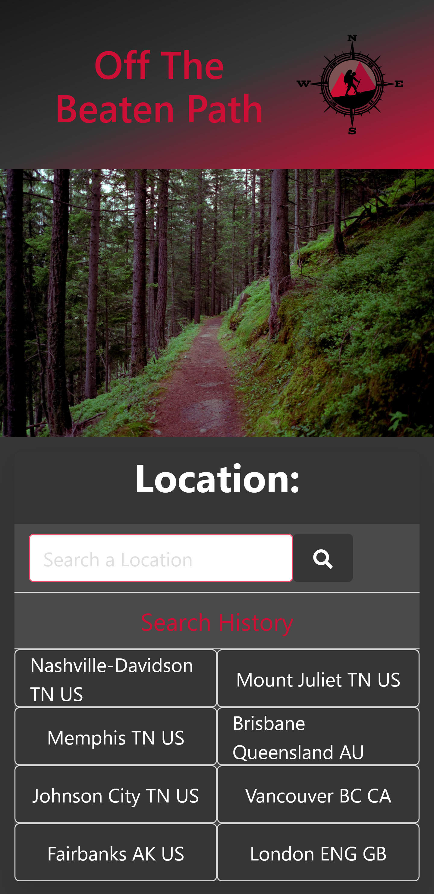
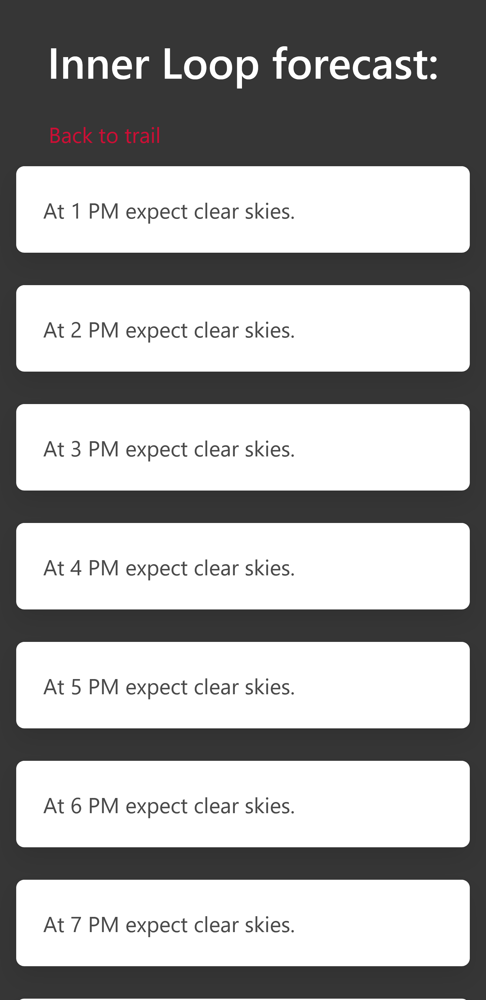

# Off the Beaten Path

Mobile Header              |  Mobile Forecast
:-------------------------:|:-------------------------:
 |  

## Purpose

A simple app that helps you find hiking trails nearby your chosen location.

### Table of Contents

- [Website](#website)
- [Built With](#built-with)
- [Resources](#resources)
- [Contribution](#contribution)
- [Features](#features)

---

## Website

https://craig5117.github.io/off-the-beaten-path/

[Back to Contents](#table-of-contents)

---

## Built With

- HTML
- CSS
- Javascript
- [JQuery](https://jquery.com/) Version Link: (https://cdnjs.cloudflare.com/ajax/libs/jquery/3.5.1/jquery.min.js)
- [Bulma](https://bulma.io/) Version Link: (https://cdn.jsdelivr.net/npm/bulma@0.9.1/css/bulma.min.css)
- [Day.js](https://day.js.org/) Version Link: (https://cdnjs.cloudflare.com/ajax/libs/dayjs/1.9.6/dayjs.min.js)

[Back to Contents](#table-of-contents)

---

## Resources

- [TomTom](https://developer.tomtom.com/)
- [Hiking Project](https://www.hikingproject.com/data)
- [OpenWeather](https://openweathermap.org/)

[Back to Contents](#table-of-contents)

---

## Features

- Search any address, city, or point of interest and find out if there are hiking trails within 50 miles of that location.
- User is provided with a summary description of the trail, trail conditions (such as wet, icy, or muddy), and a difficulty rating for the trail.
- User is also provided with a link for directions to the trail from their current location and a link to more detailed trail information at hikingproject.com.
- User can click on a trail and recieve a brief hour by hour forecast for the trail area for the next 8 hours.
- 8 of the user's most recent searches are saved as search history.

[Back to Contents](#table-of-contents)

---

## Contribution

---

---

## **Veronica Williams**

- HTML
  - UI Panel
- CSS (Bulma Framework)

### Contact Info:

GitHub: https://github.com/veta583518

LinkedIn: https://www.linkedin.com/in/veronica-williams-279a11b8/

---

---

## **Craig Bennett**

- JavaScript: API calls and coinciding data variables
- JavaScript: Search history
- HTML/JavaScript: Page Navigation

### Contact Info:

GitHub: https://github.com/Craig5117

LinkedIn: https://www.linkedin.com/in/craig-bennett-852a571b4/

---

---

## **Vlorian Dervishi**

- JavaScript: UI
- JavaScript: Data to page display

### Contact Info:

GitHub: https://github.com/vloriandervishi

LinkedIn: https://www.linkedin.com/in/vlorian-dervishi-256233191/

---

---

[Back to Contents](#table-of-contents)
